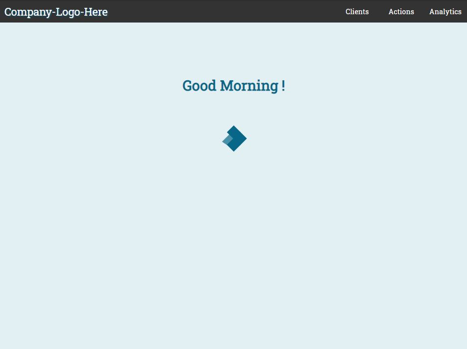
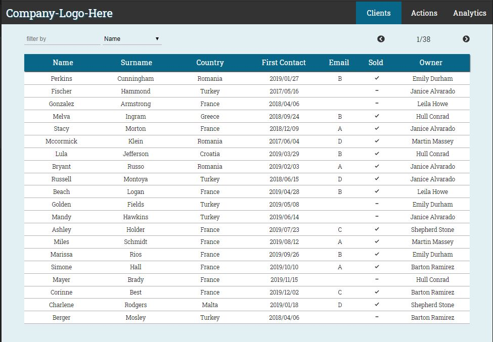
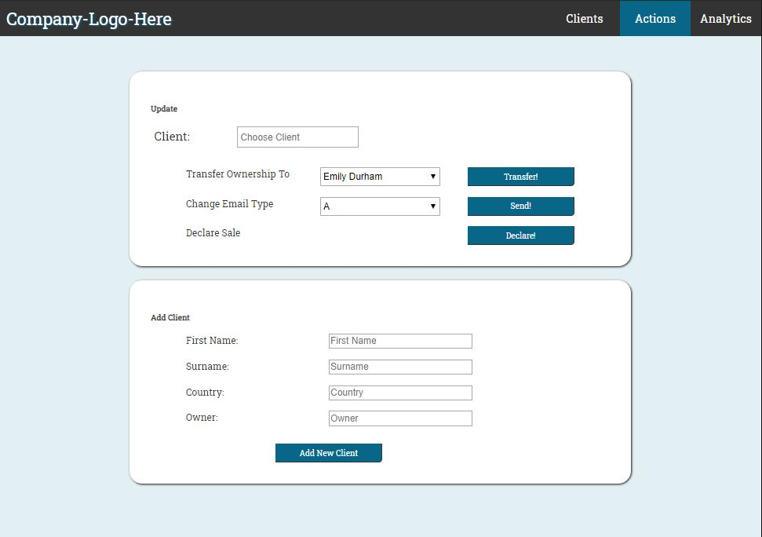
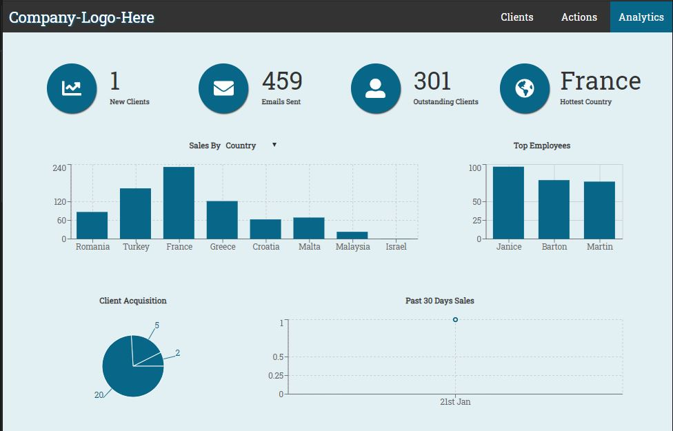

# Table Of Contents

- [Any-CRM](#any-crm)
  - [Running the project](#running-the-project)
  - [Screenshots](#screenshots)
    - [Home](#select-user)
    - [Client List](#client-list)
    - [Add or Update Client](#add-or-update-clients)
    - [ Analytics Dashboard](#analytics-dashboard)
  - [Techstack](#tech-stack)
  - [TODO](#todo)

# Any-CRM

This Client Relationship Management app is a system built with React.js. It includes a graphic analytics dashboard for company reports.

Demo: COMING SOON

## Running the project

1. Clone the repo.
2. Run `npm install`.
3. Run `mongod`.
4. Run `node server.js` from root folder.
5. Run `npm start`.
6. Navigate to `http://localhost:3000` (or other port based on the message in the console).

## Screenshots

### Home

Main loading screen - Welcomes depending on the current time of the viewers local time.

### Client List

An overview of all your clients in a table.

### Add or Update Client

Fill out the inputs and then click add or update to add a new client. When adding/updating a snackbar will popup to confirm success.

### Analytics Dashboard

View a report of all the metrics regarding your clients.

## Techstack
- React.JS
- Recharts
- Express
- MongoDB
- Axios

## TODO

1. Make Analytics as Home Page.
2. Add clients export (.csv)
3. Add dark-mode.
